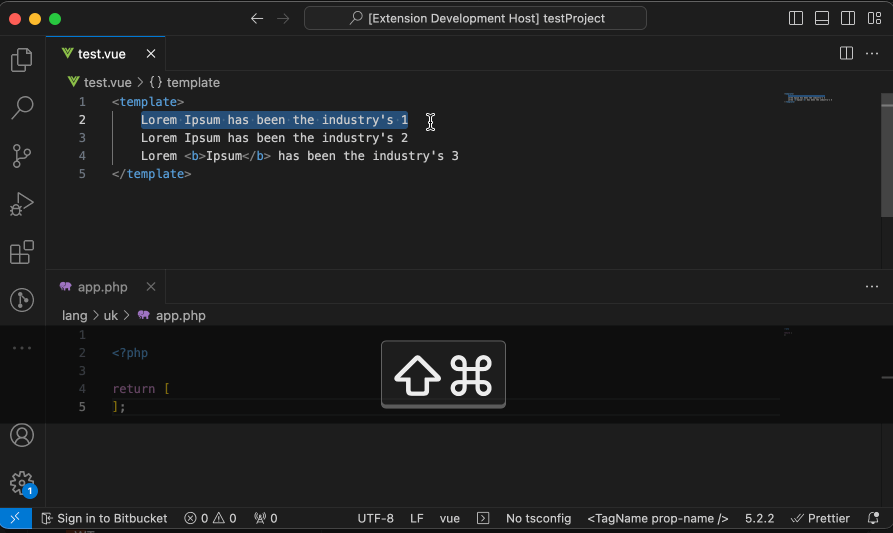
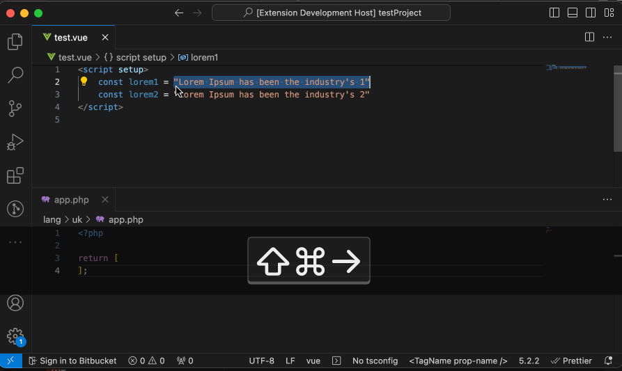

# laravel-vue-i18n README

Inspired by [laravel-vue-i18n](https://github.com/xiCO2k/laravel-vue-i18n) package, allows you to quickly populate translation rows instead of manually copying and pasting.

## Features

1. Command "Add Laravel Vue 18n template method" - replacing selected text into {{$t('{fileName}.{selected text}')}}, if a selected text contains tags it will be replaced with component <WTrans tag="{fileName}.{selected text}"/> implementing WTrans is on your own, it can look something like this

```js
<template>
  <span v-html="value" />
</template>

<script setup>
import { wTrans } from "laravel-vue-i18n";

const props = defineProps({
  tag: { type: String, required: true },
});

const value = wTrans(props.tag);
</script>
```



2. Command "Add Laravel Vue i18n template method with custom key" - the same as Add Laravel Vue 18n template method only allows you to enter a custom key instead of using selected text as a key.

3. Command "Add Laravel Vue 18n wTrans method" - replacing selected text into wTrans('app.{selected text}'), be aware around quotes will be stripped.



4.Command "Add Laravel Vue i18n wTrans method with custom key" - the same as Add Laravel Vue 18n wTrans method only allows you to enter a custom key instead of using selected text as a key.

## Extension Configuration

This extension contributes the following settings:

* `laravel-vue-i18n.translationFileName`: Translation file name, by default 'app'.
* `laravel-vue-i18n.translationFolderPaths`: Translation folder paths, by default ["/lang/en", "/lang/uk"]

## Release Notes

### 0.0.1

Initial release
